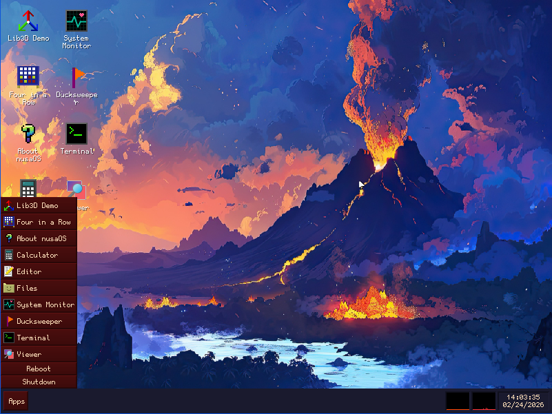

# nusaOS

A hobbyist x86 operating system, forked and evolved from [duckOS](https://github.com/byteduck/duckOS).

> **Warning:** This is highly experimental. Expect crashes, missing features, and general instability. Not for production use.
---

## What's inside

| Directory | Description |
|-----------|-------------|
| `/kernel` | Core kernel — memory, scheduling, ext2/procfs/socketfs, drivers |
| `/libraries` | Custom libc, libm, libui, libterm |
| `/programs` | Shell (`dsh`) and basic CLI utilities |
| `/services` | `init`, `pond` (window server), `dhcpclient` |
| `/toolchain` | Scripts to build the cross-compiler |
| `/scripts` | Disk image creation, QEMU boot, versioning helpers |

## Features (so far)

- Multitasking and threading
- Virtual memory / paging
- Ext2 filesystem
- Basic GUI via `pond`
- Early-stage networking

## Contributing

If you're into kernel hacking or just want to poke around, feel free. There's no shortage of bugs to fix.
