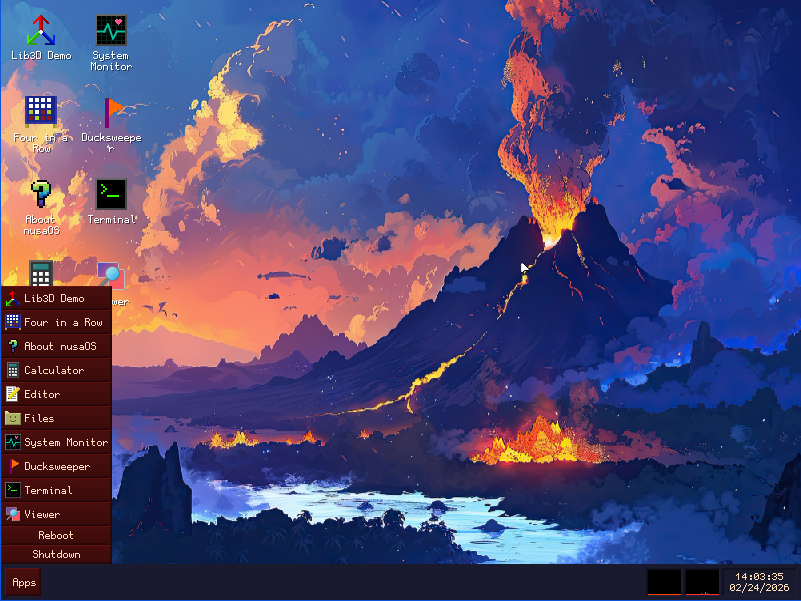

# nusaOS

A hobbyist x86 operating system, forked and evolved from [duckOS](https://github.com/byteduck/duckOS).

> **Warning:** This is highly experimental. Expect crashes, missing features, and general instability. Not for production use.

---



## What's inside

| Directory | Description |
|-----------|-------------|
| `/kernel` | Core kernel — memory, scheduling, ext2/procfs/socketfs, drivers |
| `/libraries` | Custom libc, libm, libui, libterm |
| `/programs` | Shell (`dsh`), basic CLI utilities, and NSA language toolchain |
| `/services` | `init`, `pond` (window server), `dhcpclient` |
| `/toolchain` | Scripts to build the cross-compiler |
| `/scripts` | Disk image creation, QEMU boot, versioning helpers |
| `/docs` | Documentation |

## Features (so far)

- Multitasking and threading
- Virtual memory / paging
- Ext2 filesystem
- Basic GUI via `pond`
- Early-stage networking
- **NSA Language** — a bytecode-compiled programming language that runs natively on nusaOS

## NSA Language

NSA is a programming language built specifically for nusaOS. Write code in `.nsa`, compile to `.nbin` bytecode, and run it — all with a single binary.

```sh
nsa build program.nsa    # compile
nsa run program.nbin     # run
```

**Documentation:**
- [English](docs/nsa-docs-english.md)
- [Indonesia](docs/nsa-docs-indonesia.md)